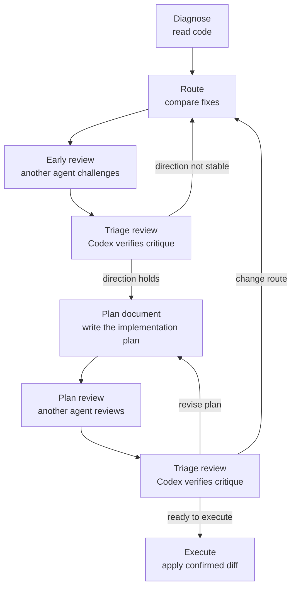

# Evidence-first Dev Workflow

English | [简体中文](README.zh-CN.md)

Evidence-first Dev Workflow is a staged Prompt workflow for AI coding: read code to locate the problem, compare routes, use adversarial review and triage to stabilize the direction, write and review the plan document, then execute strictly at the end.

It is not a universal Prompt, and it is not an autopilot flow that asks AI to go from request to production in one jump. Its goal is narrower: when you already use AI for coding but often get burned by guessing, scope creep, or premature implementation, these staged templates pull the agent back to evidence, boundaries, and verification.

## What problem it solves

The dangerous part of AI coding is usually not that the agent cannot write code. It is that the agent moves into implementation too quickly:

- It guesses before reading the relevant code.
- It mixes diagnosis, route selection, planning, and execution.
- It refactors, reformats, or touches unrelated files.
- It treats typecheck success as proof that behavior is correct.
- It accepts or rejects another AI's review without verifying the evidence.

This workflow does not ask the agent to jump from one request to the final patch. It splits development into stages that can be checked, stopped, and reviewed.

## Quick start: copy one Prompt

The recommended path is to copy a Prompt template directly.

1. First write the current issue, prior discussion, or your own idea in the message.
2. Add a separator line: `————————`.
3. Open the matching template under `prompts/en/` and copy its full content after the separator.
4. Send the complete message to your AI coding tool.
5. Follow the template boundary: read-only stages stay read-only, planning stages only produce a plan, and execution stages only apply confirmed changes.

If all you know is that something is broken, start with `prompts/en/diagnose.md`.

## Choose a template by situation

| Stage | Current situation | Template |
|---|---|---|
| Diagnose | Find the cause of a bug or locate relevant code | `prompts/en/diagnose.md` |
| Route | You have an idea and want the AI to challenge it | `prompts/en/route-with-user-idea.md` |
| Route | You have context but no good route yet, or you need the agent to propose one | `prompts/en/route-without-user-idea.md` |
| Review | You want another agent to review an early idea with code access | `prompts/en/early-idea-review-with-code.md` |
| Review | You want another agent to review an early idea from conversation only | `prompts/en/early-idea-review-from-chat.md` |
| Triage | You need to verify another agent's review before continuing | `prompts/en/review-response-triage.md` |
| Plan | You need a small change plan without editing code | `prompts/en/small-plan.md` |
| Plan | You need a multi-file or complex change plan | `prompts/en/large-plan.md` |
| Review | You want a final adversarial review before execution | `prompts/en/final-plan-review.md` |
| Triage | You need to decide whether to revise the plan, return to route selection, or execute | `prompts/en/review-response-triage.md` |
| Execute | You approved a small plan and need to execute it | `prompts/en/small-execute.md` |
| Execute | You approved a large plan and need strict execution | `prompts/en/strict-execute.md` |

## Main flow and two review loops



1. **Diagnose**: read code only, cite file-line evidence, and separate fact from inference.
2. **Route**: compare mechanisms before writing diffs.
3. **Early review**: send the route to another agent for adversarial review.
4. **Triage review**: Codex verifies the critique and decides whether to repeat review, change route, or plan.
5. **Plan**: produce the implementation plan without editing code.
6. **Plan review**: send the plan document to another agent for final review.
7. **Execute**: after review and triage pass, apply only the confirmed diff.

The core principles are evidence discipline, phase separation, minimal change, and verification before execution.

## How to fill task context

Many templates need task-specific context, such as issue symptoms, prior conversation, an existing plan, or another AI's review.

Prompt templates are copyable and editable working drafts. You can temporarily paste context into a local template, copy the complete Prompt into the AI tool, then undo the local edit or make sure private context is not committed.

If the context is long, you can put it in a local file and ask the agent to read that file path in the Prompt.

See `docs/context-injection.md` for more examples.

## Codex Skill auxiliary entry

If you use this repository with Codex, you can install or copy `skills/evidence-first-dev-workflow/` as a Codex Skill.

The Skill loads stable stage rules and can reduce repeated protocol text. But it is not the recommended main path: when a task needs context, you still need to provide that context in the chat message, or provide a file path or plan document path for the agent to read.

Do not edit files under `skills/evidence-first-dev-workflow/` to paste one-off task context. Skill files are stable rules, not scratchpads.

## Rule templates

If you want to adapt this workflow to your own tools or repositories:

- `rules/global-agent-rules.en.md`: global agent rules content that can be copied into Codex, Claude Code, Cursor, or `AGENTS.md`-style rules files.
- `rules/global-agent-rules.zh-CN.md`: Chinese global agent rules content.
- `rules/generate-project-agent-rules.en.md`: a project-level rules generator Prompt for Codex, Claude Code, or other AI coding agents to read the current repository and generate `AGENTS.md`, `CLAUDE.md`, Cursor rules, or an equivalent rules file.
- `rules/generate-project-agent-rules.zh-CN.md`: Chinese project-level rules generator Prompt.

Use `global-agent-rules` when you want long-term default behavior for a tool. Use `generate-project-agent-rules` when you want an agent to generate rules for a specific repository.

## Safety boundaries

This workflow improves control over AI coding, but it does not replace approval, rollback, audit, and permission boundaries for high-risk operations.

The following situations need extra controls:

- Production releases.
- Database migrations.
- Payment, billing, permission, or other irreversible high-risk changes.
- Automatic remote push and deployment.

## Repository structure

```text
README.md                 English entry point
README.zh-CN.md           Chinese entry point
docs/                     Workflow notes and context injection guidance
prompts/zh-CN/            Chinese Prompt templates
prompts/en/               English Prompt templates
skills/evidence-first-dev-workflow/  Codex Skill auxiliary entry
rules/                    Global rules templates and project-level rules generator
examples/                 Chinese example flows
examples/en/              English example flows
```

## More documentation

- `docs/stage-guide.md`: choose the right stage and usage mode.
- `docs/context-injection.md`: where task context should go.
- `docs/workflow.md`: overview of the main flow and review loops.
- `examples/en/bugfix-flow.md`: bugfix flow example.
- `examples/en/feature-flow.md`: feature development flow example.
- `examples/en/adversarial-review-flow.md`: adversarial review flow example.

## License

MIT
