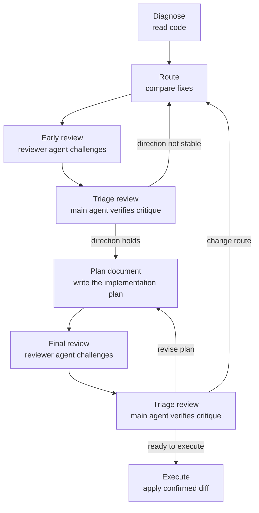

# Evidence-first Dev Workflow

English | [简体中文](README.zh-CN.md)

Evidence-first Dev Workflow is a staged Prompt workflow for AI coding: read code to locate the problem, compare routes, use adversarial review and triage to stabilize the direction, write and review the plan document, then execute strictly at the end.

It is not a universal Prompt, and it is not an autopilot flow that asks AI to go from request to production in one jump. Its goal is narrower: when you already use AI for coding but often get burned by guessing, scope creep, or premature implementation, these staged templates pull the agent back to evidence, boundaries, and verification.

## What problem it solves

The dangerous part of AI coding is usually not that the agent cannot write code. It is that the agent moves into implementation too quickly:

- It guesses before reading the relevant code.
- It mixes diagnosis, route selection, planning, and execution.
- It refactors, reformats, or touches unrelated files.
- It treats typecheck success as proof that behavior is correct.
- It accepts or rejects another AI's review without verifying the evidence.

This workflow does not ask the agent to jump from one request to the final patch. It splits development into stages that can be checked, stopped, and reviewed.

## Three ways to use it

Every template is a single file, `skills/en/ef-<name>/SKILL.md`, and that one file can be used three ways:

| Use | How | Good for |
|---|---|---|
| Copy and paste | Open SKILL.md, skip the few lines wrapped in `---` at the top, and copy the body below | No install, or AI chat in a browser |
| Claude Code | After `./install.sh en`, type `/ef-diagnose` followed by your context | Daily use in Claude Code |
| Codex | After `./install.sh en`, type `$ef-diagnose` followed by your context | Daily use in Codex |

### Install

```bash
git clone https://github.com/mafirs/evidence-first.git
cd evidence-first
./install.sh en     # Chinese templates: ./install.sh
```

`install.sh` symlinks each skill into `~/.claude/skills` (Claude Code) and `~/.agents/skills` (Codex). Existing entries with the same name are skipped, never overwritten. Run `git pull` in the repository to get updates. Start a new Claude Code or Codex session after installing. To uninstall, delete the `ef-*` links in those two directories.

Every template runs only when you invoke it by name; the AI never triggers it on its own. Claude Code uses `disable-model-invocation: true`, and Codex uses `allow_implicit_invocation: false` in `agents/openai.yaml`.

### How to provide context

- Copy and paste: write the symptom, prior discussion, or your idea first, add a separator line `————————`, then paste the template body.
- Command: write your context right after `/ef-...` or `$ef-...`. If the context is long, put it in a local file and ask the agent to read that file path.
- `<PASTE_..._HERE>` and `<PLAN_DOCUMENT_PATH>` in the templates are placeholders; replace them with the conversation, the plan, or a file path.
- Do not edit SKILL.md files in the repository to paste one-off context. Before committing or sharing, check for private conversations, local absolute paths, credentials, and internal project names.

## Choose a template by situation

The "main agent" is the AI that writes the plan and changes the code. The "reviewer agent" is a second AI that challenges it, ideally a different model or vendor.

### Main flow

| Stage | Current situation | Template | Send to |
|---|---|---|---|
| Diagnose | Something is broken; find the relevant code and root cause | `ef-diagnose` | Main agent |
| Route | The bug is located; compare fixes | `ef-route-known-problem` | Main agent |
| Route | You have your own idea and want the AI to challenge it | `ef-route-with-user-idea` | Main agent |
| Route | You have no preset direction and need the AI to propose routes | `ef-route-without-user-idea` | Main agent |
| Early review | Another AI reads the code and reviews the early idea | `ef-early-idea-review-with-code` | Reviewer agent |
| Early review | Another AI without code access reviews from the conversation only | `ef-early-idea-review-from-chat` | Reviewer agent |
| Triage | Bring the review back and verify it item by item; decide whether the direction holds | `ef-review-response-triage` | Main agent |
| Plan | A small change plan, without editing code | `ef-small-plan` | Main agent |
| Plan | A multi-file or complex change; the plan goes into a markdown document | `ef-large-plan` | Main agent |
| Final review | Last adversarial check before execution | `ef-final-plan-review` | Reviewer agent |
| Triage | Verify the final review; decide to revise the plan, return to routes, or execute | `ef-review-response-triage` | Main agent |
| Execute | A small plan you just confirmed, in the same conversation | `ef-small-execute` | Main agent |
| Execute | A reviewed plan document, executed strictly | `ef-strict-execute` | Main agent |

If all you know is that something is broken, start with `ef-diagnose`.

### Supporting templates

| Template | Purpose |
|---|---|
| `ef-task-baseline` | Keep one task baseline file during a long task, recording the goal, confirmed plan, pending items, and reference facts, so many rounds of discussion do not drift |
| `ef-co-author-mode` | Co-author mode: the quality of the work comes first, not your momentary preferences |
| `ef-answer-style` | Answer style: answer the current question first, with evidence and next steps |
| `ef-optimize-prompt` | Improve a Prompt while keeping its meaning, adding only requirements that serve the original question |
| `ef-find-reference-projects` | Search, filter, and compare mature GitHub projects worth referencing |
| `ef-subagent-dispatch` | A generic sub-agent dispatch clause to append to research tasks |

## Main flow and two review loops


```mermaid
flowchart TD
  A["Diagnose\nread code"] --> B["Route\ncompare fixes"]
  B --> C["Early review\nreviewer agent challenges"]
  C --> D["Triage review\nmain agent verifies critique"]
  D -->|direction not stable| B
  D -->|direction holds| E["Plan document\nwrite the implementation plan"]
  E --> F["Final review\nreviewer agent challenges"]
  F --> G["Triage review\nmain agent verifies critique"]
  G -->|revise plan| E
  G -->|change route| B
  G -->|ready to execute| H["Execute\napply confirmed diff"]
```

1. **Diagnose**: read code only, cite file-line evidence, and separate fact from inference.
2. **Route**: compare mechanisms before writing diffs.
3. **Early review**: send the route to the reviewer agent for adversarial review.
4. **Triage review**: the main agent verifies the critique and decides whether to repeat review, change route, or plan.
5. **Plan**: produce the implementation plan without editing code.
6. **Final review**: the reviewer agent reviews the plan document, and the main agent verifies that review.
7. **Execute**: after review and triage pass, apply only the confirmed diff.

The core principles are evidence discipline, phase separation, minimal change, and verification before execution.

End-to-end walkthroughs are in `examples/en/`: `bugfix-flow.md`, `feature-flow.md`, and `adversarial-review-flow.md`.

## Rule templates

If you want to adapt this workflow to your own tools or repositories:

- `rules/global-agent-rules.en.md`: global agent rules that can be copied into Codex, Claude Code, Cursor, or `AGENTS.md`-style rules files. Where they conflict with a stage template, the template wins.
- `rules/global-agent-rules.zh-CN.md`: Chinese global agent rules.
- `rules/generate-project-agent-rules.en.md`: a project-level rules generator Prompt that has an agent read the current repository and generate `AGENTS.md`, `CLAUDE.md`, Cursor rules, or an equivalent rules file.
- `rules/generate-project-agent-rules.zh-CN.md`: Chinese project-level rules generator Prompt.

Use `global-agent-rules` for long-term default behavior in a tool. Use `generate-project-agent-rules` to generate rules for a specific repository.

## Safety boundaries

This workflow improves control over AI coding, but it does not replace approval, rollback, audit, and permission boundaries for high-risk operations.

The following situations need extra controls:

- Production releases.
- Database migrations.
- Payment, billing, permission, or other irreversible high-risk changes.
- Automatic remote push and deployment.

## Repository structure

```text
README.md / README.zh-CN.md   English / Chinese entry points
install.sh                    links the skills into Claude Code and Codex
skills/en/ef-*/               English templates, one skill per directory (SKILL.md + agents/openai.yaml)
skills/zh-CN/ef-*/            Chinese templates
rules/                        global rules templates and project-level rules generator
examples/en/                  English example flows
examples/                     Chinese example flows
CHANGELOG.md                  release notes
```

## License

MIT
