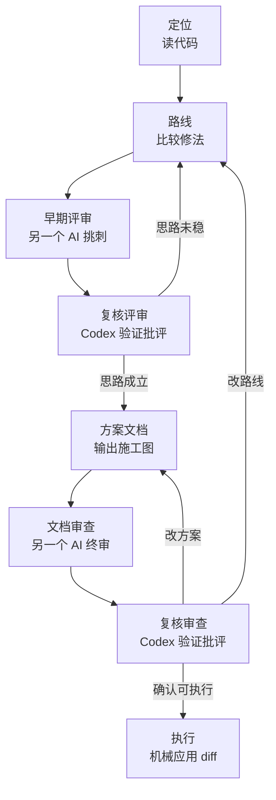

# Evidence-first Dev Workflow

[English](README.md) | 简体中文

Evidence-first Dev Workflow 是一套面向 AI coding 的分阶段 Prompt 工作流：先读代码定位问题，再比较路线；用对抗评审和复核把思路打稳；输出方案文档并审查通过后，最后严格执行。

它不是一个“万能 Prompt”，也不是让 AI 一次性从需求写到上线的自动驾驶流程。它的目标更具体：当你已经在用 AI 写代码，但经常被它的猜测、越界修改和过早实现拖累时，用一组阶段化模板把 agent 拉回证据、边界和验证。

## 它解决什么问题

AI coding 真正危险的地方，通常不是它不会写代码，而是它太快进入实现：

- 没读相关代码就开始猜。
- 把定位、路线、方案和执行混在一起。
- 顺手重构、格式化、改无关文件。
- 把 typecheck 通过当成功能正确。
- 对另一个 AI 的评审照单全收，或未经验证直接否定。

这套工作流不要求 agent 从一句需求直接跳到最终 patch，而是把一次开发拆成可以检查、可以中止、可以复核的阶段。

## 快速开始：复制一个 Prompt

推荐主路径是直接复制 Prompt 模板。

1. 先在消息里写清当前问题、已有讨论或你自己的想法。
2. 加一行分隔线：`————————`。
3. 打开 `prompts/zh-CN/` 下对应的模板，复制完整内容接在分隔线后面。
4. 把整段内容发给你的 AI coding 工具。
5. 按模板约束推进：只读阶段不改文件，方案阶段只出施工图，执行阶段只应用确认过的改动。

如果你只知道“出问题了”，从 `prompts/zh-CN/diagnose.md` 开始。

## 按场景选模板

| 阶段 | 你现在要做什么 | 使用模板 |
|---|---|---|
| 定位 | 查 bug 或定位相关代码 | `prompts/zh-CN/diagnose.md` |
| 路线 | 你有自己的优化想法，想让 AI 挑战它 | `prompts/zh-CN/route-with-user-idea.md` |
| 路线 | 已有上下文，但没有好思路或需要 agent 给路线 | `prompts/zh-CN/route-without-user-idea.md` |
| 评审 | 让另一个 AI 评审早期思路，并且允许读代码 | `prompts/zh-CN/early-idea-review-with-code.md` |
| 评审 | 让另一个 AI 只基于对话评审早期思路 | `prompts/zh-CN/early-idea-review-from-chat.md` |
| 复核 | 复核另一个 AI 的评审，决定思路是否继续 | `prompts/zh-CN/review-response-triage.md` |
| 方案 | 要一个小范围修改方案，不直接改代码 | `prompts/zh-CN/small-plan.md` |
| 方案 | 要一个多文件或复杂修改方案 | `prompts/zh-CN/large-plan.md` |
| 评审 | 正式方案执行前最后挑刺 | `prompts/zh-CN/final-plan-review.md` |
| 复核 | 复核方案批评，决定改文档、回到路线，或执行 | `prompts/zh-CN/review-response-triage.md` |
| 执行 | 已批准小方案，要严格执行 | `prompts/zh-CN/small-execute.md` |
| 执行 | 已批准完整方案，要严格执行 | `prompts/zh-CN/strict-execute.md` |

## 主流程和两个评审循环



1. **定位**：只读代码，用文件行号给证据，区分事实和推断。
2. **路线**：比较不同机制，不急着写 diff。
3. **早期评审**：把路线交给另一个 AI 挑刺。
4. **复核评审**：Codex 验证批评，决定继续评审、改路线，或进入方案。
5. **方案**：只出施工图，不改代码。
6. **文档审查**：让另一个 AI 审查方案文档。
7. **执行**：方案审查和复核通过后，只应用确认过的 diff。

核心原则是：证据优先、阶段分离、最小改动、执行前验证闭环。

## 如何填充任务上下文

很多模板都需要本次任务的上下文，例如问题现象、之前的对话、已有方案或另一个 AI 的评审。

Prompt 模板是可复制、可编辑的工作稿。你可以在本地临时把上下文粘到模板里，复制给 AI 后再撤回本地改动，或者确保这些私人上下文不会提交进仓库。

如果上下文很长，也可以把上下文放在本地文件里，然后在 Prompt 中要求 agent 读取这个文件路径。

更多示例见 `docs/context-injection.md`。

## Codex Skill 辅助入口

如果你在 Codex 中使用本仓库，可以把 `skills/evidence-first-dev-workflow/` 作为 Skill 安装或复制到 Codex skills 目录。

Skill 的作用是按阶段加载稳定规则，适合减少重复粘贴协议文本。但它不是推荐主路径：需要填充上下文的任务，仍然要在聊天消息里提供上下文，或提供一个文件路径、计划文档路径让 agent 读取。

不要修改 `skills/evidence-first-dev-workflow/` 里的 Skill 文件来粘贴一次性任务上下文。Skill 文件是稳定规则，不是草稿纸。

## 规则模板

如果你想把这套工作方式迁移到自己的工具或仓库：

- `rules/global-agent-rules.zh-CN.md`：全局 agent 规则内容，可直接放进 Codex / Claude Code / Cursor 等工具的全局规则或 `AGENTS.md` 类规则文件。
- `rules/global-agent-rules.en.md`：英文版全局 agent 规则内容。
- `rules/generate-project-agent-rules.zh-CN.md`：项目级规则生成 Prompt，让 Codex、Claude Code 或其他 AI coding agent 读取当前仓库，并生成 `AGENTS.md`、`CLAUDE.md`、Cursor rules 或等价规则文件。
- `rules/generate-project-agent-rules.en.md`：英文版项目级规则生成 Prompt。

如果你只是想给工具配置长期默认行为，复制 `global-agent-rules`。如果你想为某个具体仓库生成项目级规则，复制 `generate-project-agent-rules`。

## 安全边界

这套工作流可以提高 AI coding 的可控性，但不能替代高风险操作所需的审批、回滚、审计和权限边界。

以下场景需要额外控制：

- 生产发布。
- 数据库迁移。
- 支付、账单、权限等不可逆或高风险变更。
- 自动远程推送和发布。

## 仓库结构

```text
README.md                 英文入口
README.zh-CN.md           中文入口
docs/                     工作流说明与上下文注入说明
prompts/zh-CN/            中文 Prompt 模板
prompts/en/               英文 Prompt 模板
skills/evidence-first-dev-workflow/  Codex Skill 辅助入口
rules/                    全局规则模板与项目级规则生成 Prompt
examples/                 中文示例流程
examples/en/              英文示例流程
```

## 更多文档

- `docs/stage-guide.md`：按场景选择阶段和使用方式。
- `docs/context-injection.md`：任务上下文应该放在哪里。
- `docs/workflow.md`：主流程和评审循环概览。
- `examples/bugfix-flow.md`：bugfix 流程示例。
- `examples/feature-flow.md`：功能开发流程示例。
- `examples/adversarial-review-flow.md`：对抗评审流程示例。

## License

MIT
