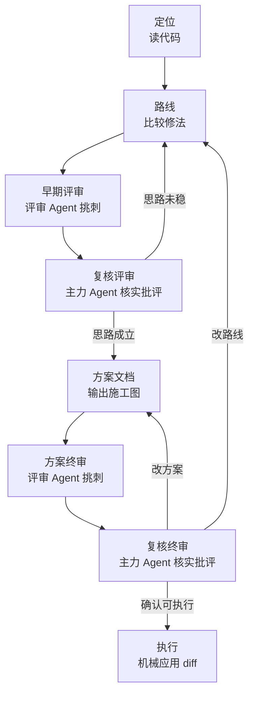

# Evidence-first Dev Workflow

[English](README.md) | 简体中文

Evidence-first Dev Workflow 是一套面向 AI coding 的分阶段 Prompt 工作流：先读代码定位问题，再比较路线；用对抗评审和复核把思路打稳；输出方案文档并审查通过后，最后严格执行。

它不是一个“万能 Prompt”，也不是让 AI 一次性从需求写到上线的自动驾驶流程。它的目标更具体：当你已经在用 AI 写代码，但经常被它的猜测、越界修改和过早实现拖累时，用一组阶段化模板把 agent 拉回证据、边界和验证。

## 它解决什么问题

AI coding 真正危险的地方，通常不是它不会写代码，而是它太快进入实现：

- 没读相关代码就开始猜。
- 把定位、路线、方案和执行混在一起。
- 顺手重构、格式化、改无关文件。
- 把 typecheck 通过当成功能正确。
- 对另一个 AI 的评审照单全收，或未经验证直接否定。

这套工作流不要求 agent 从一句需求直接跳到最终 patch，而是把一次开发拆成可以检查、可以中止、可以复核的阶段。

## 三种用法

每个模板都是 `skills/zh-CN/ef-<名字>/SKILL.md` 这一个文件，同一个文件有三种用法：

| 用法 | 怎么做 | 适合 |
|---|---|---|
| 复制粘贴 | 打开 SKILL.md，跳过开头用 `---` 包住的几行说明，复制下面的正文 | 不想安装，或在网页版 AI 里用 |
| Claude Code | 运行 `./install.sh` 后输入 `/ef-diagnose`，后面接上下文 | 日常用 Claude Code |
| Codex | 运行 `./install.sh` 后输入 `$ef-diagnose`，后面接上下文 | 日常用 Codex |

### 安装

```bash
git clone https://github.com/mafirs/evidence-first.git
cd evidence-first
./install.sh        # 英文模板用 ./install.sh en
```

`install.sh` 会把每个 skill 软链接到 `~/.claude/skills`（Claude Code）和 `~/.agents/skills`（Codex）。遇到同名项目时跳过，不覆盖。以后在仓库里 `git pull` 就能拿到更新。装好后新开一个 Claude Code 或 Codex 会话即可使用。卸载时删掉这两个目录下以 `ef-` 开头的链接。

所有模板都只在你点名时运行，不会被 AI 自动触发：Claude Code 靠 `disable-model-invocation: true`，Codex 靠 `agents/openai.yaml` 里的 `allow_implicit_invocation: false`。

### 上下文怎么给

- 复制粘贴时：先写问题现象、已有讨论或你的想法，加一行分隔线 `————————`，再粘贴模板正文。
- 命令调用时：在 `/ef-...` 或 `$ef-...` 后面直接写上下文。上下文很长时，放进本地文件，让 agent 读这个文件路径。
- 模板里的 `<PASTE_..._HERE>`、`<PLAN_DOCUMENT_PATH>` 是占位符，换成对话内容、方案或文件路径。
- 不要为了粘贴一次性上下文去改仓库里的 SKILL.md。提交或分享前，检查是否带入了私人对话、本地绝对路径、密钥或内部项目名。

## 按场景选模板

“主力 Agent”指写方案、改代码的那个 AI；“评审 Agent”指另一个负责挑刺的 AI，最好换一个模型或厂商。

### 主流程

| 阶段 | 你现在的情况 | 模板 | 发给 |
|---|---|---|---|
| 定位 | 只知道出了问题，要找相关代码和根因 | `ef-diagnose` | 主力 Agent |
| 路线 | bug 已经定位，要比较修法 | `ef-route-known-problem` | 主力 Agent |
| 路线 | 有自己的优化想法，想让 AI 挑战它 | `ef-route-with-user-idea` | 主力 Agent |
| 路线 | 没有预设方向，需要 AI 铺路线 | `ef-route-without-user-idea` | 主力 Agent |
| 早期评审 | 让另一个 AI 读代码后评审早期思路 | `ef-early-idea-review-with-code` | 评审 Agent |
| 早期评审 | 另一个 AI 读不到代码，只基于对话评审 | `ef-early-idea-review-from-chat` | 评审 Agent |
| 复核 | 把评审意见交回来逐条核实，决定思路是否继续 | `ef-review-response-triage` | 主力 Agent |
| 方案 | 小范围修改方案，不直接改代码 | `ef-small-plan` | 主力 Agent |
| 方案 | 多文件或复杂修改，方案写进 md 文档 | `ef-large-plan` | 主力 Agent |
| 终审 | 正式方案执行前最后挑刺 | `ef-final-plan-review` | 评审 Agent |
| 复核 | 核实终审意见，决定改方案、回到路线还是执行 | `ef-review-response-triage` | 主力 Agent |
| 执行 | 刚确认的小方案，在同一个对话里执行 | `ef-small-execute` | 主力 Agent |
| 执行 | 已审查通过的方案文档，严格执行 | `ef-strict-execute` | 主力 Agent |

如果你只知道“出问题了”，从 `ef-diagnose` 开始。

### 辅助模板

| 模板 | 用途 |
|---|---|
| `ef-task-baseline` | 长任务里维护一份任务基线文件，记录目标、已确认方案、待确认项和参考信息，避免多轮讨论后跑偏 |
| `ef-co-author-mode` | 合著者模式：以作品质量为先，不迎合你的即时偏好 |
| `ef-answer-style` | 回答表达规范：先回答当前问题，说清依据和下一步 |
| `ef-optimize-prompt` | 优化一段 Prompt，保留原意，只补充直接服务于原问题的要求 |
| `ef-find-reference-projects` | 按你的预期搜索、筛选并比较值得参考的成熟 GitHub 项目 |
| `ef-subagent-dispatch` | 通用子 Agent 分派条款，可以接在检索类任务后面 |

## 主流程和两个评审循环


```mermaid
flowchart TD
  A["定位\n读代码"] --> B["路线\n比较修法"]
  B --> C["早期评审\n评审 Agent 挑刺"]
  C --> D["复核评审\n主力 Agent 核实批评"]
  D -->|思路未稳| B
  D -->|思路成立| E["方案文档\n输出施工图"]
  E --> F["方案终审\n评审 Agent 挑刺"]
  F --> G["复核终审\n主力 Agent 核实批评"]
  G -->|改方案| E
  G -->|改路线| B
  G -->|确认可执行| H["执行\n机械应用 diff"]
```

1. **定位**：只读代码，用文件行号给证据，区分事实和推断。
2. **路线**：比较不同机制，不急着写 diff。
3. **早期评审**：把路线交给评审 Agent 挑刺。
4. **复核评审**：主力 Agent 核实批评，决定继续评审、改路线，或进入方案。
5. **方案**：只出施工图，不改代码。
6. **方案终审**：让评审 Agent 审查方案文档，主力 Agent 再核实一遍。
7. **执行**：方案终审和复核通过后，只应用确认过的 diff。

核心原则是：证据优先、阶段分离、最小改动、执行前验证闭环。

完整走一遍的示例见 `examples/`：`bugfix-flow.md`（修 bug）、`feature-flow.md`（做功能）、`adversarial-review-flow.md`（处理评审意见）。

## 规则模板

如果你想把这套工作方式迁移到自己的工具或仓库：

- `rules/global-agent-rules.zh-CN.md`：全局 agent 规则，可直接放进 Codex / Claude Code / Cursor 等工具的全局规则或 `AGENTS.md` 类规则文件。和阶段模板冲突时，以阶段模板为准。
- `rules/global-agent-rules.en.md`：英文版全局 agent 规则。
- `rules/generate-project-agent-rules.zh-CN.md`：项目级规则生成 Prompt，让 agent 读取当前仓库，生成 `AGENTS.md`、`CLAUDE.md`、Cursor rules 或等价规则文件。
- `rules/generate-project-agent-rules.en.md`：英文版项目级规则生成 Prompt。

只想给工具配置长期默认行为，复制 `global-agent-rules`；想为某个具体仓库生成项目级规则，复制 `generate-project-agent-rules`。

## 安全边界

这套工作流可以提高 AI coding 的可控性，但不能替代高风险操作所需的审批、回滚、审计和权限边界。

以下场景需要额外控制：

- 生产发布。
- 数据库迁移。
- 支付、账单、权限等不可逆或高风险变更。
- 自动远程推送和发布。

## 仓库结构

```text
README.md / README.zh-CN.md   英文 / 中文入口
install.sh                    把 skill 链接到 Claude Code 和 Codex
skills/zh-CN/ef-*/            中文模板，每个目录一个 skill（SKILL.md + agents/openai.yaml）
skills/en/ef-*/               英文模板
rules/                        全局规则模板与项目级规则生成 Prompt
examples/                     中文示例流程
examples/en/                  英文示例流程
CHANGELOG.md                  版本变更记录
```

## License

MIT
